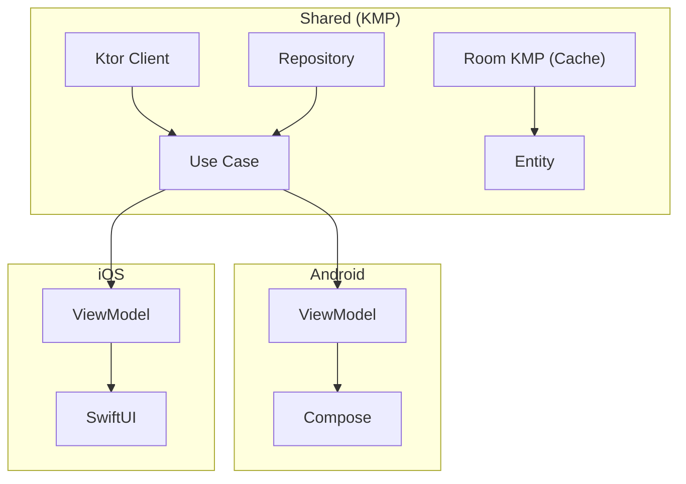

<div align="center">

# CivitDeck

**CivitAI のモデル・画像・プロンプトを Android & iOS でネイティブにブラウズ**

Kotlin Multiplatform (KMP) で構築

[](LICENSE)
[](https://kotlinlang.org)
[]()
[](https://github.com/rioX432/CivitDeck/actions/workflows/ci.yml)

[English](README.md) | [日本語](README.ja.md)

</div>

---

## なぜ CivitDeck？

[CivitAI](https://civitai.com/) は、数十万のモデル、LoRA、AI 生成画像をホストする、最大のオープンソース生成 AI コミュニティです。しかし **公式モバイルアプリは存在しません**。

CivitDeck がそのギャップを埋めます。モデルの閲覧、画像の探索、プロンプトの確認、お気に入りの保存 — すべてスマートフォンから。

## スクリーンショット

<!-- TODO: 実際のスクリーンショットを追加 -->

| Android | iOS |
|---------|-----|
|  |  |
|  |  |
|  |  |

## 機能

- **モデル検索・閲覧** — タイプ（Checkpoint、LoRA など）、ソート、期間、タグでフィルタリング
- **イメージギャラリー** — スタッガードグリッドとフルスクリーンビューア、ピンチズーム対応
- **プロンプトメタデータ** — 生成パラメータ（プロンプト、モデル、サンプラー、シード）の閲覧とワンタップコピー
- **お気に入り** — モデルと画像をローカルに保存してオフラインアクセス
- **クロスプラットフォーム** — 共有 KMP コードベースから、ネイティブ Android（Jetpack Compose）& iOS（SwiftUI）

## 技術スタック

| レイヤー | 技術 |
|---------|------|
| **共有 (KMP)** | Ktor Client, Kotlinx Serialization, Room KMP, Koin |
| **Android** | Jetpack Compose, Material Design 3, Navigation 3, Coil |
| **iOS** | SwiftUI |
| **アーキテクチャ** | Clean Architecture + MVVM (UDF) |
| **CI/CD** | GitHub Actions |

## アーキテクチャ

詳細は [ARCHITECTURE.md](ARCHITECTURE.md) を参照。



## はじめに

### 前提条件

- Android Studio Ladybug 以降
- Xcode 15+（iOS の場合）
- JDK 17+

### ビルド & 実行

```bash
# クローン
git clone https://github.com/rioX432/CivitDeck.git
cd CivitDeck

# Android
./gradlew :androidApp:installDebug

# iOS
open iosApp/iosApp.xcodeproj
```

## ロードマップ

### Phase 1 — MVP
- [x] プロジェクトセットアップ (KMP + Android + iOS)
- [x] CivitAI API クライアント (Ktor)
- [x] モデル検索・閲覧 (Android)
- [x] モデル詳細画面 (Android)
- [x] ローカルお気に入り & オフラインキャッシュ (Room KMP)
- [x] イメージギャラリー & メタデータビューア (Android)
- [x] ドキュメント (README, ARCHITECTURE, CONTRIBUTING)

### Phase 2 — iOS & ポリッシュ
- [x] iOS モデル検索画面 (SwiftUI)
- [x] iOS モデル詳細画面 (SwiftUI)
- [x] iOS イメージギャラリー画面 (SwiftUI)
- [ ] CivitAI アカウント連携 (API Key 認証)
- [ ] クリエイタープロフィール
- [ ] タグベース探索
- [ ] グローバルリリース & マーケティング

### Phase 3 — 上級機能
- [ ] 画像比較ツール
- [ ] プロンプトテンプレート管理
- [ ] ComfyUI / SD WebUI 連携
- [ ] ホーム画面ウィジェット（人気モデル）

## コントリビューション

コントリビューション歓迎です！ガイドラインは [CONTRIBUTING.md](CONTRIBUTING.md) を参照してください。

このプロジェクトが役に立ったら、ぜひ **スター** をお願いします — 他の人が CivitDeck を見つける助けになります。

## ライセンス

このプロジェクトは MIT License の下でライセンスされています — 詳細は [LICENSE](LICENSE) ファイルを参照してください。

## 作者

**RIO** ([@rioX432](https://github.com/rioX432))

東京在住のモバイルアプリ開発者 — Android | iOS | KMP
