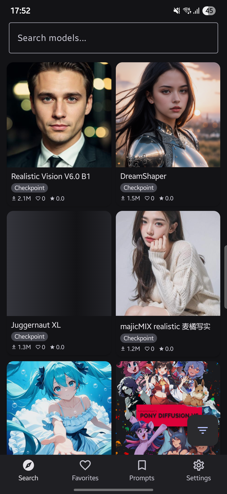
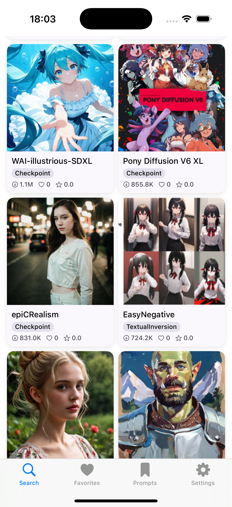
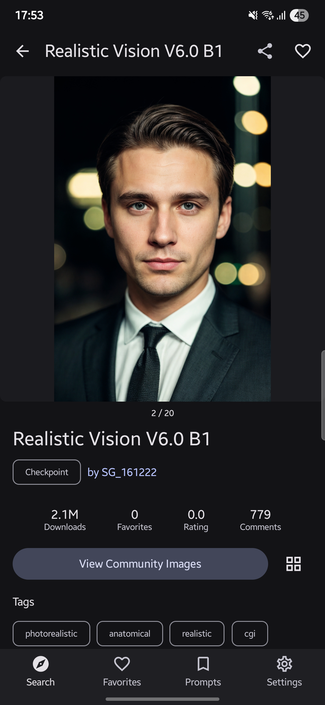
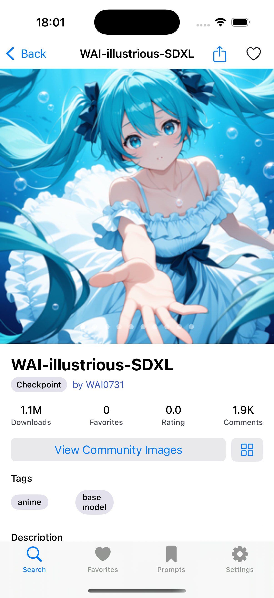
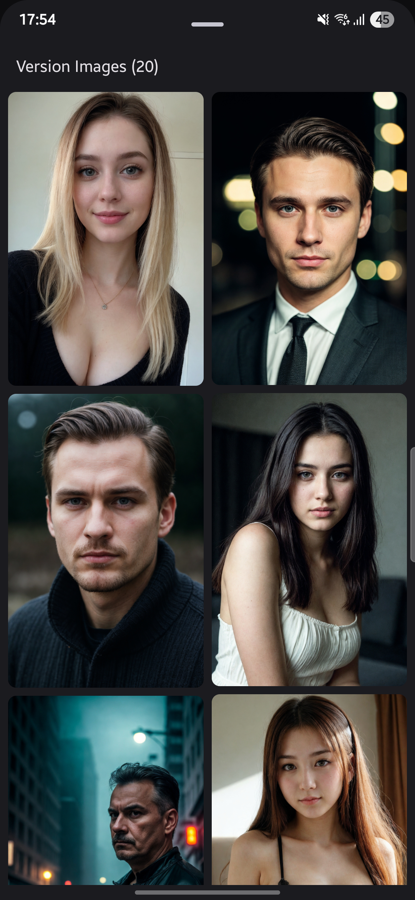
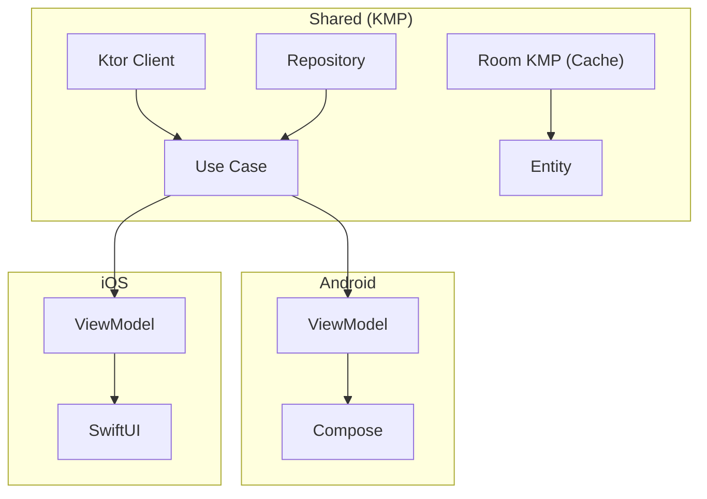

<div align="center">


# CivitDeck

**CivitAI パワーユーザークライアント -- モデル閲覧・比較・生成ワークフローへの橋渡し**

Kotlin Multiplatform (KMP) | Android & iOS

[](LICENSE)
[](https://kotlinlang.org)
[]()
[](https://github.com/rioX432/CivitDeck/actions/workflows/ci.yml)

[English](README.md) | [日本語](README.ja.md)

</div>

---

## 課題

1. **CivitAI にモバイルアプリがない** -- 最大のオープンソース生成 AI コミュニティなのに、ネイティブモバイル体験がない。デスクトップサイトをピンチズームで見るしかない。
2. **ワークフローへの橋渡しがない** -- CivitAI で見つけたモデルを ComfyUI や A1111 で使うには、パラメータを手動でコピーする必要がある。
3. **メタデータが埋もれている** -- 生成パラメータ（プロンプト、サンプラー、CFG、シード）は何度もクリックしないと見えない。モデル比較も面倒。

CivitDeck がこの 3 つを解決する。

## スクリーンショット

| Android | iOS |
|---------|-----|
|  |  |
|  |  |
|  |  |

## 機能

### 実装済み

- **モデル検索・閲覧** -- タイプ（Checkpoint、LoRA など）、ソート、期間、タグでフィルタリング
- **イメージギャラリー** -- スタッガードグリッドとフルスクリーンビューア、ピンチズーム対応
- **プロンプトメタデータ** -- 生成パラメータの閲覧とワンタップコピー
- **お気に入り** -- モデルと画像をローカルに保存してオフラインアクセス
- **Fresh Find** -- トレンド前の新着モデルを発見
- **クロスプラットフォーム** -- 共有 KMP コードベースからネイティブ Android（Jetpack Compose）& iOS（SwiftUI）

### 開発予定

- **ComfyUI 連携** -- モバイルからワークフロー実行・パラメータエクスポート ([#148](https://github.com/rioX432/CivitDeck/issues/148))
- **パワーユーザーモード** -- 全生成パラメータを表示する詳細メタデータパネル ([#150](https://github.com/rioX432/CivitDeck/issues/150))
- **プロンプトテンプレート** -- プロンプトの保存・整理・再利用 ([#149](https://github.com/rioX432/CivitDeck/issues/149))
- **モデル比較** -- バージョンの横並び比較 ([#118](https://github.com/rioX432/CivitDeck/issues/118))
- **ワンタップエクスポート** -- ComfyUI ワークフロー JSON や A1111 形式への変換 ([#151](https://github.com/rioX432/CivitDeck/issues/151))

全機能の計画は[ロードマップ](ROADMAP.md)を参照。

## 対象ユーザー

- **モデルハンター** -- 毎日 CivitAI で新しいチェックポイントや LoRA を探している人
- **プロンプトエンジニア** -- 高評価画像の生成パラメータを研究して自分のワークフローを改善する人
- **ComfyUI/A1111 ユーザー** -- CivitAI でのモデル発見とローカル環境をシームレスにつなぎたい人

## 技術スタック

| レイヤー | 技術 |
|---------|------|
| **共有 (KMP)** | Ktor Client, Kotlinx Serialization, Room KMP, Koin |
| **Android** | Jetpack Compose, Material Design 3, Navigation 3, Coil |
| **iOS** | SwiftUI |
| **アーキテクチャ** | Clean Architecture + MVVM (UDF) |
| **CI/CD** | GitHub Actions |

## アーキテクチャ

詳細は [ARCHITECTURE.md](ARCHITECTURE.md) を参照。



## はじめに

### 前提条件

- Android Studio Ladybug 以降
- Xcode 15+（iOS の場合）
- JDK 17+

### ビルド & 実行

```bash
# クローン
git clone https://github.com/rioX432/CivitDeck.git
cd CivitDeck

# Android
./gradlew :androidApp:installDebug

# iOS
open iosApp/iosApp.xcodeproj
```

## コントリビューション

コントリビューション歓迎！ガイドラインは [CONTRIBUTING.md](CONTRIBUTING.md) を参照。

特に以下の領域の貢献を歓迎:
- **ComfyUI / SD WebUI 連携** -- API クライアント、ワークフローエクスポート形式、プロトコル対応
- **パワーユーザー機能** -- メタデータパネル、比較ツール、テンプレートシステム

## プロジェクトを支援

CivitDeck が役に立ったら:

- **スター**をお願いします -- 他の人がプロジェクトを見つける助けになります
- [**スポンサー**](https://github.com/sponsors/rioX432) -- 開発を支援
- [**Issue を作成**](https://github.com/rioX432/CivitDeck/issues/new/choose) -- バグ報告や機能リクエスト

## 免責事項

CivitDeck は非公式のコミュニティ製クライアントです。Civitai Inc. との提携・推薦・関連はありません。CivitAI のデータはすべて公開 API を通じてアクセスしています。

## ライセンス

このプロジェクトは MIT License の下でライセンスされています -- 詳細は [LICENSE](LICENSE) ファイルを参照。

## 作者

**RIO** ([@rioX432](https://github.com/rioX432))

東京在住のモバイルアプリ開発者 -- Android | iOS | KMP
