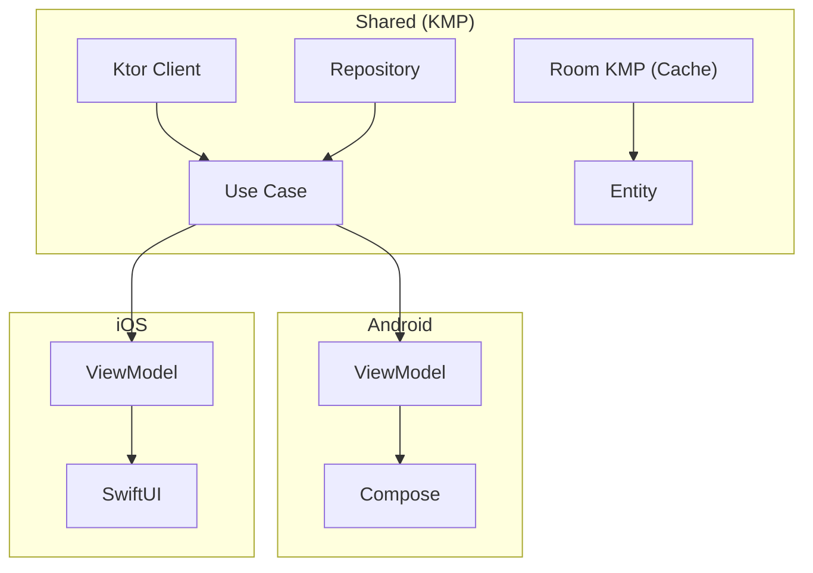

<div align="center">


# CivitDeck

**The power user client for CivitAI -- browse, compare, and bridge to your generation workflow**

Built with Kotlin Multiplatform (KMP) | Android & iOS

[](LICENSE)
[](https://kotlinlang.org)
[]()
[](https://github.com/rioX432/CivitDeck/actions/workflows/ci.yml)

[English](README.md) | [日本語](README.ja.md)

</div>

---

## The Problem

1. **No mobile app for CivitAI** -- the largest open-source generative AI community has no native mobile experience. You're stuck pinch-zooming a desktop site.
2. **No workflow bridge** -- finding a great model on CivitAI and using it in ComfyUI or A1111 means manually copying parameters across devices.
3. **Metadata is buried** -- generation parameters (prompt, sampler, CFG, seed) are hidden behind multiple clicks. Comparing models is tedious.

CivitDeck solves all three.

## Screenshots

| Android | iOS |
|---------|-----|
|  |  |
|  |  |
|  |  |

## Features

### Available Now

- **Model Search & Browse** -- filter by type (Checkpoint, LoRA, etc.), sort, period, and tags
- **Image Gallery** -- staggered grid with full-screen viewer and pinch-to-zoom
- **Prompt Metadata** -- view generation parameters and copy with one tap
- **Favorites** -- save models and images locally for offline access
- **Fresh Find** -- discover recently published models before they trend
- **Cross-Platform** -- native Android (Jetpack Compose) & iOS (SwiftUI) from a shared KMP codebase

### Coming Soon

- **ComfyUI integration** -- trigger workflows and export parameters directly from mobile ([#148](https://github.com/rioX432/CivitDeck/issues/148))
- **Power user mode** -- advanced metadata panel with full generation parameters ([#150](https://github.com/rioX432/CivitDeck/issues/150))
- **Prompt templates** -- save, organize, and reuse prompts across sessions ([#149](https://github.com/rioX432/CivitDeck/issues/149))
- **Model comparison** -- side-by-side version comparison ([#118](https://github.com/rioX432/CivitDeck/issues/118))
- **One-tap export** -- export to ComfyUI workflow JSON or A1111 format ([#151](https://github.com/rioX432/CivitDeck/issues/151))

See the full [Roadmap](ROADMAP.md) for all planned features.

## Who Is This For?

- **Model hunters** -- you browse CivitAI daily looking for new checkpoints and LoRAs to try
- **Prompt engineers** -- you study generation parameters from top-rated images to refine your own workflows
- **ComfyUI/A1111 users** -- you want a seamless bridge between discovering models on CivitAI and using them in your local setup

## Tech Stack

| Layer | Technology |
|-------|-----------|
| **Shared (KMP)** | Ktor Client, Kotlinx Serialization, Room KMP, Koin |
| **Android** | Jetpack Compose, Material Design 3, Navigation 3, Coil |
| **iOS** | SwiftUI |
| **Architecture** | Clean Architecture + MVVM (UDF) |
| **CI/CD** | GitHub Actions |

## Architecture

See [ARCHITECTURE.md](ARCHITECTURE.md) for detailed documentation.



## Getting Started

### Prerequisites

- Android Studio Ladybug or later
- Xcode 15+ (for iOS)
- JDK 17+

### Build & Run

```bash
# Clone
git clone https://github.com/rioX432/CivitDeck.git
cd CivitDeck

# Android
./gradlew :androidApp:installDebug

# iOS
open iosApp/iosApp.xcodeproj
```

## Contributing

Contributions are welcome! See [CONTRIBUTING.md](CONTRIBUTING.md) for guidelines.

We especially welcome contributions related to:
- **ComfyUI / SD WebUI integration** -- API clients, workflow export formats, protocol support
- **Power user features** -- metadata panels, comparison tools, template systems

## Support the Project

If you find CivitDeck useful:

- Give it a **star** -- it helps others discover the project
- [**Sponsor**](https://github.com/sponsors/rioX432) -- support ongoing development
- [**Open an issue**](https://github.com/rioX432/CivitDeck/issues/new/choose) -- report bugs or request features

## Disclaimer

CivitDeck is an unofficial, community-built client. It is not affiliated with, endorsed by, or associated with Civitai Inc. All CivitAI data is accessed through their public API.

## License

This project is licensed under the MIT License -- see the [LICENSE](LICENSE) file for details.

## Author

**RIO** ([@rioX432](https://github.com/rioX432))

Mobile App Developer based in Tokyo -- Android | iOS | KMP
