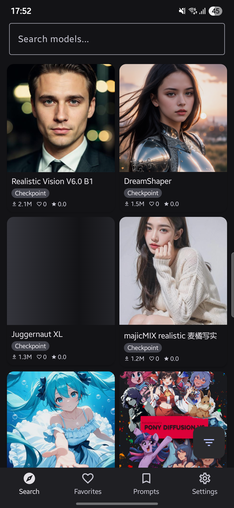
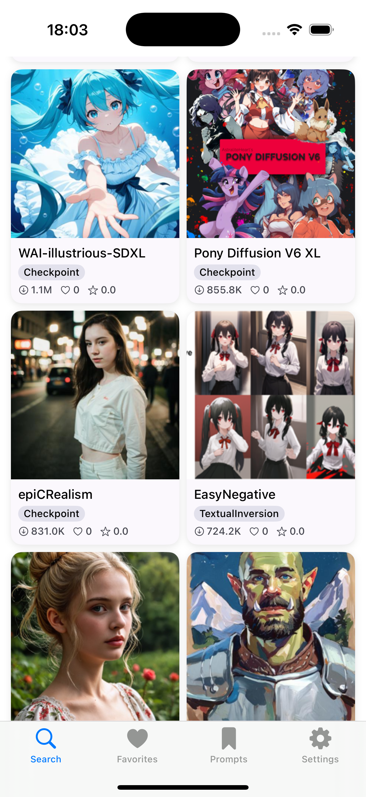
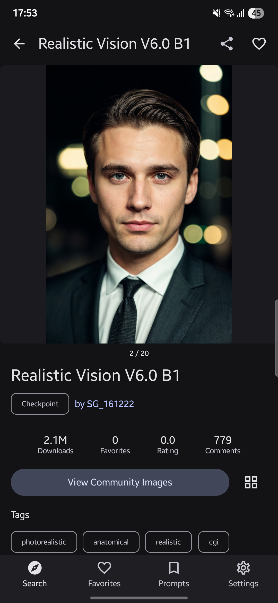
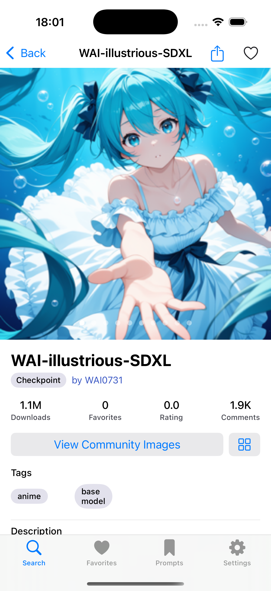
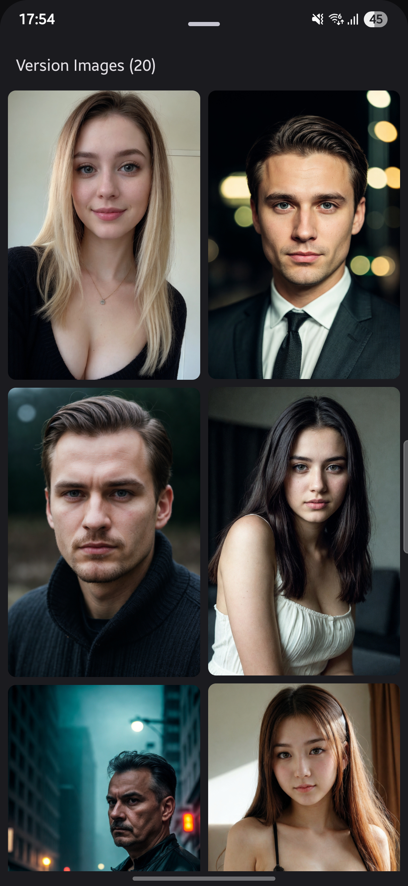
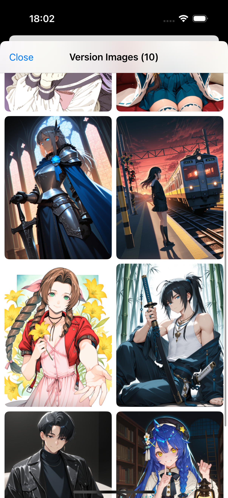
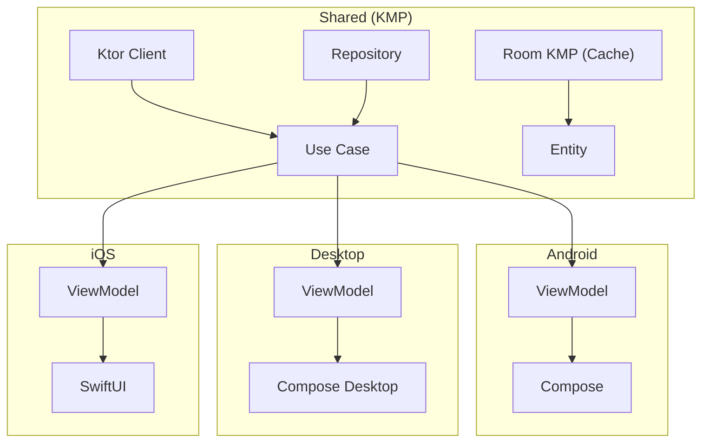

<div align="center">


# CivitDeck

**The power user client for CivitAI — browse, compare, and bridge to your generation workflow**

Built with Kotlin Multiplatform (KMP) | Android, iOS & Desktop

[](LICENSE)
[](https://kotlinlang.org)
[]()
[](https://github.com/rioX432/CivitDeck/actions/workflows/ci.yml)
[](https://github.com/sponsors/rioX432)

[English](README.md) | [日本語](README.ja.md)

</div>

---

## Screenshots

| Android | iOS |
|---------|-----|
|  |  |
|  |  |
|  |  |

## Why CivitDeck?

1. **Workflow fragmentation** — you find a model on CivitAI, then manually copy parameters into ComfyUI or A1111. There's no bridge between discovery and generation.
2. **Metadata is buried** — generation parameters (prompt, sampler, CFG, seed) are hidden behind multiple clicks. Comparing model versions is tedious.
3. **Mobile web is painful** — CivitAI's desktop site on mobile means pinch-zooming, slow loads, and no offline access.

CivitDeck is built for power users and creators who generate, not just browse.

## Features

- **Model Search & Browse** — filter by type (Checkpoint, LoRA, etc.), sort, period, and tags
- **Swipe Discovery** — swipe-card stack for fast model browsing with gesture quick-actions
- **Image Gallery** — staggered grid with full-screen viewer, pinch-to-zoom, and NSFW blur control
- **Prompt Metadata** — view generation parameters and copy with one tap
- **Prompt Templates** — built-in and user-created templates with variable support
- **Favorites & Collections** — organize saved models into named collections
- **ComfyUI & SD WebUI Integration** — send models to ComfyUI or Automatic1111/Forge, manage the generation queue, browse generation history, import custom workflows, and use LoRA/ControlNet support
- **Civitai Link** — sync models directly to your ComfyUI instance via Civitai Link key
- **AI Training Datasets** — collect ComfyUI generation outputs into labeled datasets with auto-tagging (seed, sampler, prompt hash), caption/tag batch editing, duplicate detection, and source tracking for model training
- **Saved Search Filters** — save and quickly recall named search presets with filters (type, sort, period, tags, NSFW level)
- **Multi-Source Search** — unified search across CivitAI, HuggingFace, and TensorArt with platform filter and source indicators
- **Custom External Servers** — connect to any REST API image server, browse its gallery with filters, multi-select bulk delete, and image zoom modal
- **Model Comparison** — compare two models side-by-side
- **Model File Browser** — detect local model files with CivitAI hash matching
- **Creator Follow & Feed** — follow creators and get a personalized feed of their latest models with pull-to-refresh
- **Analytics** — usage analytics with browsing/search frequency charts and model popularity insights
- **Social Sharing** — share models with customizable hashtags (#AIart, #ComfyUI, etc.) and copy/share to any app
- **QR Code Sharing** — share and scan model links via QR code
- **Model Notes & Tags** — add personal notes and tags to any model for your own organization
- **Community Reviews** — read and submit reviews on models
- **Backup & Restore** — export/import app data (collections, prompts, filters, notes, datasets) with granular category selection
- **Background Downloads** — download model files with background progress tracking and notifications
- **ComfyHub** — browse and import community workflows from ComfyHub directly into your workflow library
- **Image Similarity Search** — find visually similar models across the platform
- **Model Update Notifications** — get notified when followed models receive updates
- **Smart Recommendations** — personalized model suggestions with time-decay scoring and engagement tracking
- **Browsing History** — dedicated history screen with search frequency charts
- **Plugin System** — extend CivitDeck with plugins for workflow engines (ComfyUI, External Server), export formats (kohya-ss), and themes
- **Video Preview** — play video previews directly in gallery and model detail screens
- **Fresh Find** — discover recently published models before they trend
- **Quality Filter** — filter models by calculated quality score based on downloads, favorites, and ratings
- **Integrations Hub** — unified management screen for ComfyUI, SD WebUI, Civitai Link, and external servers
- **Cross-Platform** — native Android (Jetpack Compose), iOS (SwiftUI) & Desktop (Compose Desktop) from a shared KMP codebase

See the full [Roadmap](docs/ROADMAP.md) for planned features.

## Who Is This For?

- **Model hunters** — you browse CivitAI daily looking for new checkpoints and LoRAs to try
- **Prompt engineers** — you study generation parameters from top-rated images to refine your own workflows
- **ComfyUI/A1111 users** — you want a seamless bridge between discovering models on CivitAI and using them in your local setup

## Tech Stack

| Layer | Technology |
|-------|-----------|
| **Shared (KMP)** | Ktor Client, Kotlinx Serialization, Room KMP, Koin |
| **Android** | Jetpack Compose, Material Design 3, Navigation 3, Coil |
| **Desktop** | Compose Desktop (JVM), Material Design 3, Coil |
| **iOS** | SwiftUI |
| **Architecture** | Clean Architecture + MVVM (UDF) |
| **CI/CD** | GitHub Actions |

## Architecture

See [ARCHITECTURE.md](docs/ARCHITECTURE.md) for detailed documentation.


```mermaid
graph TB
    subgraph shared["Shared (KMP)"]
        ktor["Ktor Client"] & repo["Repository"] --> usecase["Use Case"]
        room["Room KMP (Cache)"] --> entity["Entity"]
    end
    subgraph android["Android"]
        avm["ViewModel"] --> compose["Compose"]
    end
    subgraph desktop["Desktop"]
        dvm["ViewModel"] --> cdesktop["Compose Desktop"]
    end
    subgraph ios["iOS"]
        ivm["ViewModel"] --> swiftui["SwiftUI"]
    end
    usecase --> avm
    usecase --> dvm
    usecase --> ivm
```

## Getting Started

### Prerequisites

- Android Studio Ladybug or later
- Xcode 15+ (for iOS)
- JDK 17+

### Build & Run

```bash
# Clone
git clone https://github.com/rioX432/CivitDeck.git
cd CivitDeck

# Android
./gradlew :androidApp:installDebug

# Desktop (macOS / Windows / Linux)
./gradlew :desktopApp:run

# iOS
open iosApp/iosApp.xcodeproj
```

## Changelog

See [CHANGELOG.md](CHANGELOG.md) for a full list of changes.

## Contributing

Contributions are welcome! See [CONTRIBUTING.md](docs/CONTRIBUTING.md) for guidelines.

For security issues, see [SECURITY.md](SECURITY.md).

We especially welcome contributions related to:
- **ComfyUI / SD WebUI integration** — API clients, workflow export formats, protocol support
- **Power user features** — metadata panels, comparison tools, template systems

## Support the Project

If CivitDeck improves your daily CivitAI workflow, consider supporting development:

- Give it a **star** — it helps others discover the project
- [**Sponsor**](https://github.com/sponsors/rioX432) — fund ongoing development and new features
- [**Open an issue**](https://github.com/rioX432/CivitDeck/issues/new/choose) — report bugs or request features

## Disclaimer

CivitDeck is an unofficial, community-built client. It is not affiliated with, endorsed by, or associated with Civitai Inc. All CivitAI data is accessed through their public API.

## License

This project is licensed under the MIT License — see the [LICENSE](LICENSE) file for details.

## Author

**RIO** ([@rioX432](https://github.com/rioX432))

Mobile App Developer based in Tokyo — Android | iOS | KMP
