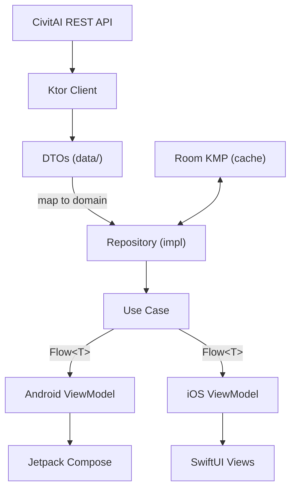

# Architecture

This document describes CivitDeck's architecture, module structure, data flow, and key design decisions.

## Module Structure

```
CivitDeck/
├── shared/                    # KMP shared module
│   └── src/
│       ├── commonMain/        # Cross-platform shared code
│       │   └── kotlin/
│       │       ├── data/
│       │       │   ├── api/           # Ktor API client, DTOs, request/response models
│       │       │   ├── local/         # Room database, DAOs, entities
│       │       │   └── repository/    # Repository implementations
│       │       ├── domain/
│       │       │   ├── model/         # Domain entities (pure Kotlin)
│       │       │   ├── repository/    # Repository interfaces
│       │       │   └── usecase/       # Use cases (single-responsibility)
│       │       └── di/               # Koin dependency injection modules
│       ├── androidMain/       # Android-specific implementations (e.g., Room driver)
│       └── iosMain/           # iOS-specific implementations (e.g., Room driver)
├── androidApp/                # Android application
│   └── src/main/kotlin/
│       ├── di/                # Android Koin module
│       └── ui/
│           ├── navigation/    # Navigation 3 routes & NavDisplay
│           ├── search/        # Model search screen + ViewModel
│           ├── detail/        # Model detail screen + ViewModel
│           ├── creator/       # Creator profile screen
│           ├── favorites/     # Favorites screen
│           ├── gallery/       # Image gallery screen + ViewModel
│           ├── prompts/       # Prompts screen
│           ├── settings/      # Settings screen
│           ├── components/    # Reusable Compose components
│           └── theme/         # Design tokens (colors, typography, spacing)
└── iosApp/                    # iOS application
    └── iosApp/
        ├── Features/          # Feature-based modules
        │   ├── Search/        # Search screen + ViewModel
        │   ├── Detail/        # Detail screen + ViewModel
        │   ├── Creator/       # Creator profile
        │   ├── Favorites/     # Favorites screen
        │   ├── Gallery/       # Image gallery
        │   ├── Prompts/       # Prompts screen
        │   └── Settings/      # Settings screen
        └── DesignSystem/      # Design tokens + shared components
```

## Data Flow



## Layer Responsibilities

### Data Layer (`shared/data/`)

- **API**: Ktor HTTP client targeting `https://civitai.com/api/v1`. Endpoints include `/models`, `/models/:id`, `/model-versions/:id`, `/images`, `/creators`, and `/tags`. Pagination is cursor-based for images and page-based for others.
- **Local**: Room KMP database for offline favorites and response caching with TTL.
- **Repository Implementations**: Combine remote API calls with local cache. Return domain models, not DTOs.

### Domain Layer (`shared/domain/`)

- **Models**: Pure Kotlin data classes with no framework dependencies.
- **Repository Interfaces**: Contracts that the data layer implements.
- **Use Cases**: Single-responsibility classes with one public function each, returning `Flow` or `StateFlow`.

### UI Layer (Platform-specific)

- **Android**: Jetpack Compose with Material Design 3. Navigation uses AndroidX Navigation 3 with type-safe routes. ViewModels extend `androidx.lifecycle.ViewModel`.
- **iOS**: SwiftUI with native navigation (`NavigationStack`). Feature-based structure under `Features/`. ViewModels use `ObservableObject` protocol. Custom `CachedAsyncImage` for image loading (no third-party dependency). Design tokens in `DesignSystem/`.

## Key Design Decisions

### Why KMP?

Kotlin Multiplatform allows sharing business logic (networking, caching, domain models) between Android and iOS while keeping UI fully native. This avoids the compromises of cross-platform UI frameworks while eliminating duplicate business logic.

### Why Clean Architecture?

Strict separation between data, domain, and UI layers enables:
- Testable business logic independent of frameworks
- Swappable data sources (API, cache, mock)
- Platform-specific UI without touching shared code

### Why Room KMP over SQLDelight?

Room KMP provides the same API as Jetpack Room (familiar to Android developers) while supporting KMP. It handles schema migrations with compile-time verification.

### Why Platform-specific ViewModels?

ViewModels are intentionally **not** in the shared module. Each platform has its own lifecycle and state management patterns:
- Android: `androidx.lifecycle.ViewModel` with `viewModelScope`
- iOS: `ObservableObject` with `@Published` properties

The shared module exposes `UseCase` classes returning `Flow`, which each platform's ViewModel subscribes to.

### Why Navigation 3 (Android)?

AndroidX Navigation 3 is the latest navigation library with full type-safe route support and first-class Compose integration. It replaces string-based navigation with Kotlin data classes.

## Dependency Injection

Koin is used as the DI framework across all modules:

- **Shared module** (`shared/di/`): Defines modules for API clients, repositories, and use cases
- **Android** (`androidApp/di/`): Extends shared modules with Android-specific bindings (ViewModels, platform dependencies)
- **iOS** (`iosApp/`): Initializes Koin in app entry point, resolves use cases for SwiftUI ViewModels

## CI/CD

GitHub Actions runs on every push to `master` and on pull requests:

1. **Android job**: Shared unit tests → Detekt lint → Debug APK build
2. **iOS job**: SwiftLint → Xcode build for iOS Simulator

See `.github/workflows/ci.yml` for the full configuration.
