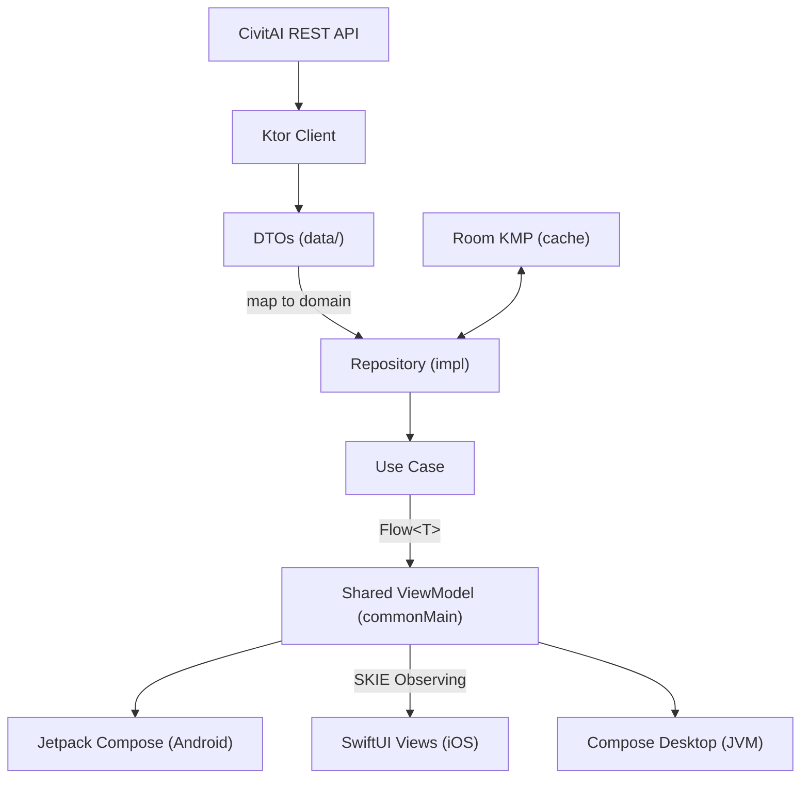

# Architecture

This document describes CivitDeck's architecture, module structure, data flow, and key design decisions.

## Module Structure

```
CivitDeck/
├── build-logic/              # Convention Plugins (civitdeck.kmp.library, civitdeck.kmp.feature, civitdeck.android.application)
├── shared/                   # KMP coordinator — re-exports core + feature modules via api()
│   └── src/
│       ├── commonMain/       # DI wiring (ViewModelModules), repository impls, PluginManagementVM
│       ├── androidMain/      # Android-specific Koin setup
│       ├── jvmMain/          # Desktop-specific Koin setup
│       └── iosMain/          # iOS Koin setup, KoinHelper (split into 7 files)
├── core/
│   ├── core-domain/          # Domain layer: models, repository interfaces, use cases
│   │   └── src/commonMain/kotlin/.../
│   │       ├── domain/model/         # Pure Kotlin domain entities
│   │       ├── domain/repository/    # Repository interfaces (contracts)
│   │       ├── domain/usecase/       # Single-responsibility use cases (return Flow)
│   │       └── di/                   # DomainModule (Koin)
│   ├── core-network/         # Network layer: Ktor client, DTOs, API services
│   │   └── src/commonMain/kotlin/.../
│   │       ├── data/api/             # CivitAI, ComfyUI, SD WebUI, ExternalServer API clients + DTOs
│   │       └── di/                   # NetworkModule (Koin)
│   ├── core-database/        # Local storage only: Room KMP entities, DAOs, migrations
│   │   └── src/commonMain/kotlin/.../
│   │       ├── data/local/           # Entities, DAOs, CivitDeckDatabase (v48)
│   │       ├── data/local/migration/ # Sequential migrations (1→2 … 47→48)
│   │       └── di/                   # DatabaseModule (Koin) — no longer depends on core-network
│   ├── core-data/            # Data aggregation: network+cache repositories (ModelRepositoryImpl,
│   │   │                     # LocalModelFileRepositoryImpl, UpdateRepositoryImpl, CreatorFollowRepositoryImpl)
│   │   └── src/commonMain/kotlin/.../
│   │       ├── data/repository/      # Repo impls combining core-network + core-database + DTO→domain mappers
│   │       └── di/                   # coreDataModule (Koin) — loaded after network→database
│   ├── core-ui/              # Shared Compose components + design tokens (KMP: Android + Desktop)
│   │   └── src/{androidMain,jvmMain}/kotlin/.../
│   │       ├── ui/components/        # LoadingStateOverlay, ErrorStateView, ModelStatsRow, …
│   │       └── ui/theme/             # CivitDeckColors, CivitDeckTypography, CivitDeckSpacing
│   ├── core-plugin/          # Plugin system: interfaces, registry, capability adapters
│   │   └── src/commonMain/kotlin/.../
│   │       ├── plugin/               # Plugin API, PluginRegistry, InMemoryPluginRegistry
│   │       ├── plugin/capability/    # ExportFormatPlugin, ThemePlugin, WorkflowEnginePlugin
│   │       ├── plugin/model/         # Plugin data models
│   │       └── plugin/di/            # PluginModule (Koin)
│   └── core-testing/         # Shared test infra (commonMain): fake repositories, ApplicationScope(TestScope)
│       └── src/commonMain/kotlin/.../ # helper, Turbine — consumed by feature/core commonTest
├── feature/                  # Feature modules — each owns its ViewModels + use cases in commonMain
│   ├── feature-search/       # Search, swipe discovery, text search, similar models, browsing history
│   ├── feature-detail/       # Model detail view + model comparison
│   ├── feature-gallery/      # Image gallery, downloads, analytics, notifications, share, update
│   ├── feature-creator/      # Creator profiles, follow system, feed
│   ├── feature-collections/  # Collections, datasets, batch tag editor, export
│   ├── feature-prompts/      # Saved prompts + template library
│   ├── feature-settings/     # Settings (auth, display, content filter, storage, app behavior, backup)
│   ├── feature-comfyui/      # ComfyUI/SDWebUI integration, workflow templates, ComfyHub, CivitaiLink
│   └── feature-externalserver/ # Custom external server gallery + generation
├── androidApp/               # Android app entry point
│   └── src/main/kotlin/
│       ├── CivitDeckApplication.kt   # Koin init + ViewModel DI
│       ├── ui/navigation/            # Navigation 3 routes & NavDisplay
│       ├── ui/components/            # ModelCard, SwipeableModelCard (Nav3 dependency)
│       ├── ui/dataset/               # Dataset screens + DuplicateReviewViewModel (platform-specific)
│       ├── ui/downloadqueue/         # Download queue screen (ViewModel now shared)
│       ├── ui/compare/               # Model comparison screen
│       ├── ui/analytics/             # Usage analytics screen
│       ├── ui/backup/                # Backup & restore screen
│       ├── ui/feed/                  # Creator follow feed screen
│       ├── ui/plugin/               # Plugin management screen
│       ├── download/                 # Background model downloads (WorkManager)
│       ├── widget/                   # Glance home screen widgets
│       ├── tile/                     # Quick Settings tile
│       └── notification/             # Background polling notifications
├── desktopApp/               # Desktop app entry point (Compose Desktop / JVM)
│   └── src/jvmMain/kotlin/
│       ├── Main.kt                   # Application entry point, Window setup
│       ├── navigation/               # State-based routing (no Navigation 3)
│       └── ui/                       # Desktop screens + 2 Desktop-only ViewModels (DesktopUpdateViewModel, DesktopDiscoveryViewModel)
└── iosApp/                   # iOS app entry point (SwiftUI)
    └── iosApp/
        ├── Features/         # Feature-based screens; ViewModels consumed via SKIE Observing
        │   ├── Search/       │   ├── Detail/       │   ├── Gallery/
        │   ├── Creator/      │   ├── Collections/  │   ├── Prompts/
        │   ├── Settings/     │   ├── ComfyUI/      │   ├── Dataset/
        │   ├── Compare/      │   ├── ExternalServer/ │   ├── ModelFileBrowser/
        │   ├── Analytics/    │   ├── Backup/       │   ├── Discovery/
        │   ├── Feed/         │   ├── Download/     │   ├── QRCode/
        │   └── Plugin/       │   └── Tutorial/     │   └── Shortcuts/
        └── DesignSystem/     # Design tokens + shared components
            ├── CivitDeckColors.swift   ├── CivitDeckFonts.swift
            ├── CivitDeckSpacing.swift  ├── CivitDeckMotion.swift
            ├── CivitDeckShapes.swift   ├── CachedAsyncImage.swift
            └── ShimmerModifier.swift
```

## Data Flow


```mermaid
graph TB
    api["CivitAI REST API"] --> ktor["Ktor Client"]
    ktor --> dto["DTOs (data/)"]
    dto -- "map to domain" --> repo["Repository (impl)"]
    room["Room KMP (cache)"] <--> repo
    repo --> usecase["Use Case"]
    usecase -- "Flow&lt;T&gt;" --> vm["Shared ViewModel (commonMain)"]
    vm --> compose["Jetpack Compose (Android)"]
    vm -- "SKIE Observing" --> swiftui["SwiftUI Views (iOS)"]
    vm --> desktop["Compose Desktop (JVM)"]
```

## Layer Responsibilities

### Data Layer (`core/core-network/` + `core/core-database/` + `core/core-data/`)

- **API** (`core-network`): Ktor HTTP client targeting `https://civitai.com/api/v1`. Endpoints include `/models`, `/models/:id`, `/model-versions/:id`, `/images`, `/creators`, and `/tags`. Pagination is cursor-based for images and page-based for others. Also includes API clients for ComfyUI (REST + WebSocket), SD WebUI (Automatic1111/Forge), Civitai Link, ComfyHub, custom External Servers, multi-source search (HuggingFace, TensorArt), and GitHub Releases (in-app update check).
- **Local** (`core-database`): Room KMP database (version 48) for offline favorites, user collections, saved prompts, saved search filters, SD WebUI/ComfyUI connections, external server configs, dataset collections, model notes, followed creators, feed cache, model downloads, plugin data, quality scores, and response caching with TTL. Migrations tracked sequentially from version 1. This module is pure local storage and does **not** depend on `core-network`.
- **Repository Implementations** (`core-data`): Combine remote API calls with local cache and map DTOs → domain models. `ModelRepositoryImpl` and friends live here (extracted from `core-database`) so the database layer stays network-free; `core-data` depends on both `core-network` and `core-database`.

### Domain Layer (`core/core-domain/`)

- **Models**: Pure Kotlin data classes with no framework dependencies.
- **Repository Interfaces**: Contracts that the data layer implements.
- **Use Cases**: Single-responsibility classes with one public function each, returning `Flow` or `StateFlow`.

### Presentation Layer (Shared ViewModels)

ViewModels live in their owning feature modules (`feature/*/src/commonMain/.../presentation/`). Only `PluginManagementViewModel` remains in the shared module. All extend `androidx.lifecycle.ViewModel` (KMP-compatible since lifecycle 2.9.0) and expose `StateFlow` properties.

All 3 platforms consume the **same ViewModel instance** — there is no per-platform ViewModel duplication:

- **Android** injects shared ViewModels via Koin (`koinViewModel()`) and collects `StateFlow` with `collectAsStateWithLifecycle()`
- **Desktop** injects shared ViewModels via Koin (`koinViewModel()`) and collects with `collectAsState()`
- **iOS** consumes shared ViewModels via [SKIE](https://skie.touchlab.co/) — each VM is wrapped in a Swift `*Owner` class (holds `ViewModelStore` for lifecycle management) and state is observed via `for await state in vm.uiState`

Platform-specific dependencies are handled via `expect/actual`:
- `DownloadScheduler` — interface in `core-domain`, with platform implementations (WorkManager on Android, no-op on iOS/Desktop)

Remaining platform-specific ViewModels:
- **Android**: `DuplicateReviewViewModel` (1)
- **Desktop**: `DesktopUpdateViewModel` (Desktop-only update check) and `DesktopDiscoveryViewModel` (recommendations-only, no swipe)

### UI Layer (Platform-specific)

- **Android**: Jetpack Compose with Material Design 3. Navigation uses AndroidX Navigation 3 with type-safe routes.
- **Desktop**: Compose Desktop (JVM target) with Material Design 3. Navigation uses state-based routing (Navigation 3 is not available on JVM). Uses `collectAsState()` (not `collectAsStateWithLifecycle()`). Coil image loading without context. Supports keyboard shortcuts.
- **iOS**: SwiftUI with native navigation (`NavigationStack`). Feature-based structure under `Features/`. Custom `CachedAsyncImage` for image loading (no third-party dependency). Design tokens in `DesignSystem/`.

## Key Design Decisions

### Why KMP?

Kotlin Multiplatform allows sharing business logic (networking, caching, domain models) between Android, iOS, and Desktop while keeping UI fully native. This avoids the compromises of cross-platform UI frameworks while eliminating duplicate business logic.

### Why Clean Architecture?

Strict separation between data, domain, and UI layers enables:
- Testable business logic independent of frameworks
- Swappable data sources (API, cache, mock)
- Platform-specific UI without touching shared code

### Why Room KMP over SQLDelight?

Room KMP provides the same API as Jetpack Room (familiar to Android developers) while supporting KMP. It handles schema migrations with compile-time verification.

### Why Shared ViewModels?

ViewModels are shared in `commonMain` using `androidx.lifecycle.ViewModel` (KMP-compatible since lifecycle 2.9.0). Each ViewModel lives in its owning feature module. All 3 platforms consume the **same ViewModel class** — no per-platform duplication of state management logic.

- **Android** injects via Koin `koinViewModel()` and collects with `collectAsStateWithLifecycle()`
- **Desktop** injects via Koin `koinViewModel()` and collects with `collectAsState()`
- **iOS** wraps each VM in a Swift `*Owner` class (for `ViewModelStore` lifecycle) and observes `StateFlow` via SKIE's async sequence bridging

Platform-specific dependencies (e.g., WorkManager for downloads) are abstracted via `expect/actual` interfaces (e.g., `DownloadScheduler`), keeping the ViewModel itself fully shared. Only 2 Desktop-specific VMs remain (`DesktopUpdateViewModel` for Desktop-only update check, `DesktopDiscoveryViewModel` for recommendations-only discovery).

### Why Navigation 3 (Android)?

AndroidX Navigation 3 is the latest navigation library with full type-safe route support and first-class Compose integration. It replaces string-based navigation with Kotlin data classes.

## Dependency Injection

Koin is used as the DI framework across all modules:

- **core-network** (`core/core-network/.../di/NetworkModule`): Ktor client, CivitAI, ComfyUI, SD WebUI, and ExternalServer API services
- **core-database** (`core/core-database/.../di/DatabaseModule`): Room DB instance, all DAOs (loaded before core-data)
- **core-data** (`core/core-data/.../di/CoreDataModule`): Network+cache repository bindings (`ModelRepositoryImpl`, etc.); load order is network → database → core-data
- **core-domain** (`core/core-domain/.../di/DomainModule` + `DomainPlatformModule`): Repository bindings, use case factory; `domainPlatformModule` (`expect`/`actual`) provides platform service impls (embedding models, notification/lifecycle/monitor services) via constructor injection
- **core-plugin** (`core/core-plugin/.../di/PluginModule`): Plugin registry, built-in capability adapters
- **shared** (`shared/src/commonMain/di/`): Re-exports core modules; `SharedViewModelModule`, `Phase3ViewModelModule`, `SettingsViewModelModule` for shared ViewModels; platform export bindings (`DatasetZipWriterFactory`, `ExportPathProvider`) in `PlatformModule.<platform>`
- **Android** (`androidApp/CivitDeckApplication.kt`): Platform-specific bindings (DownloadScheduler actual, DuplicateReviewViewModel), platform drivers
- **Desktop** (`desktopApp/`): 2 Desktop-only ViewModel registrations (`DesktopUpdateViewModel`, `DesktopDiscoveryViewModel`), JVM platform drivers (shared VMs are auto-registered via feature module Koin modules)
- **iOS** (`shared/src/iosMain/di/KoinHelper.kt`): ViewModel accessors for SwiftUI consumption via `KoinHelper.shared.getXxx()`

## CI/CD

GitHub Actions runs on every push to `master` and on pull requests. A `changes` job (`dorny/paths-filter@v3`) first detects which platform paths changed; each platform job then only runs if its own path, `shared`/`core`/`feature` (which touch all platforms), or the CI workflow itself changed:

1. **Android job**: `testAndroidHostTest` for `shared`, `core-domain`, `core-network`, `core-data`, and the KMP feature modules that have Android host tests (`feature-search`, `feature-detail`, `feature-gallery`, `feature-prompts`, `feature-creator`, `feature-externalserver`) + `jvmTest` for `core-database` and `feature-comfyui` (Android-actual `Context`/`Log` requirements push those tests to the JVM target) → root `detekt` (all modules) → `:androidApp:assembleDebug`
2. **Desktop job**: `:desktopApp:compileKotlinJvm`
3. **iOS job** (`macos-26` / Xcode 26, arm64-only): SwiftLint (`--strict`) → `xcodebuild build` with `ARCHS=arm64 ONLY_ACTIVE_ARCH=NO` (the KMP framework only configures `iosSimulatorArm64`, so a generic-arch build fails to resolve `Shared.framework`)

See `.github/workflows/ci.yml` for the full configuration.
