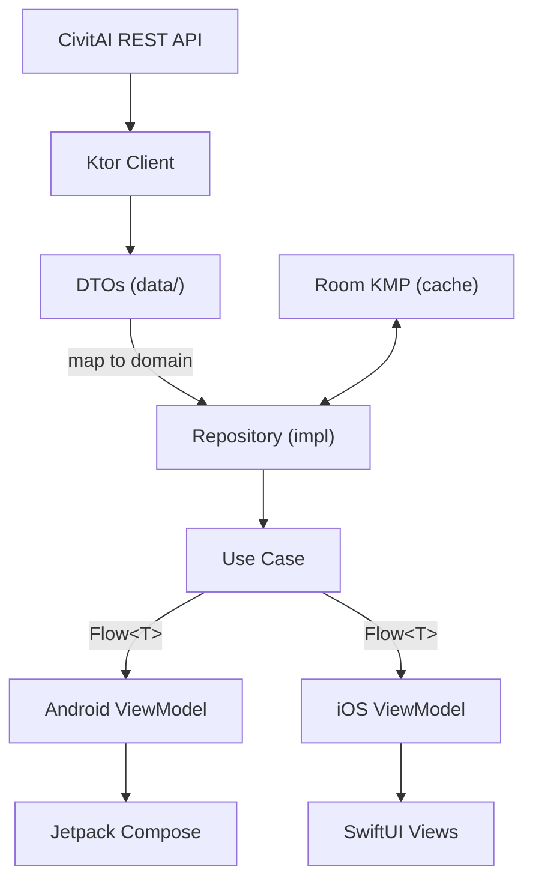

# Architecture

This document describes CivitDeck's architecture, module structure, data flow, and key design decisions.

## Module Structure

```
CivitDeck/
├── build-logic/              # Convention Plugins (civitdeck.kmp.library, civitdeck.kmp.feature, civitdeck.android.application)
├── shared/                   # KMP coordinator — re-exports core modules via api()
│   └── src/
│       ├── commonMain/       # DI wiring, ViewModelModule (SettingsViewModel)
│       ├── androidMain/      # Android-specific Koin setup
│       └── iosMain/          # iOS Koin setup, KoinHelper.kt
├── core/
│   ├── core-domain/          # Domain layer: models, repository interfaces, use cases
│   │   └── src/commonMain/kotlin/.../
│   │       ├── domain/model/         # Pure Kotlin domain entities
│   │       ├── domain/repository/    # Repository interfaces (contracts)
│   │       ├── domain/usecase/       # Single-responsibility use cases (return Flow)
│   │       └── di/                   # DomainModule (Koin)
│   ├── core-network/         # Network layer: Ktor client, DTOs, API services
│   │   └── src/commonMain/kotlin/.../
│   │       ├── data/api/             # CivitAI, ComfyUI, SD WebUI, ExternalServer API clients + DTOs
│   │       └── di/                   # NetworkModule (Koin)
│   ├── core-database/        # Database layer: Room KMP entities, DAOs, migrations
│   │   └── src/commonMain/kotlin/.../
│   │       ├── data/local/           # Entities, DAOs, CivitDeckDatabase (v31)
│   │       ├── data/local/migration/ # Sequential migrations (1→2 … 30→31)
│   │       └── di/                   # DatabaseModule (Koin)
│   ├── core-ui/              # Shared Compose components + design tokens (Android-only)
│   │   └── src/main/kotlin/.../
│   │       ├── ui/components/        # LoadingStateOverlay, ErrorStateView, ModelStatsRow, …
│   │       └── ui/theme/             # CivitDeckColors, CivitDeckTypography, CivitDeckSpacing
│   └── core-plugin/          # Plugin system: interfaces, registry, capability adapters
│       └── src/commonMain/kotlin/.../
│           ├── plugin/               # Plugin API, PluginRegistry, InMemoryPluginRegistry
│           ├── plugin/capability/    # ExportFormatPlugin, ThemePlugin, WorkflowEnginePlugin
│           ├── plugin/model/         # Plugin data models
│           └── plugin/di/            # PluginModule (Koin)
├── feature/
│   ├── feature-search/       # Model search & swipe discovery
│   ├── feature-detail/       # Model detail view + model comparison
│   ├── feature-gallery/      # Image gallery with NSFW blur and prompt extraction
│   ├── feature-creator/      # Creator profile browser
│   ├── feature-collections/  # User model collections (create, rename, bulk manage)
│   ├── feature-prompts/      # Saved prompts + template library (built-in & user-created)
│   ├── feature-settings/     # App settings (NSFW, appearance, notifications, storage)
│   ├── feature-comfyui/      # ComfyUI integration: generation, queue, LoRA/ControlNet, workflow import
│   └── feature-externalserver/ # Custom external server: connection management, image gallery, filters
├── androidApp/               # Android app entry point
│   └── src/main/kotlin/
│       ├── CivitDeckApplication.kt   # Koin init + ViewModel DI
│       ├── ui/navigation/            # Navigation 3 routes & NavDisplay
│       ├── ui/components/            # ModelCard, SwipeableModelCard (Nav3 dependency)
│       ├── ui/dataset/               # Dataset list/detail screens + AddToDataset sheet
│       ├── ui/compare/               # Model comparison screen
│       ├── ui/analytics/             # Usage analytics screen
│       ├── ui/backup/                # Backup & restore screen
│       ├── ui/feed/                  # Creator follow feed screen
│       ├── ui/plugin/               # Plugin management screen
│       ├── download/                 # Background model downloads (WorkManager)
│       ├── widget/                   # Glance home screen widgets
│       ├── tile/                     # Quick Settings tile
│       └── notification/             # Background polling notifications
└── iosApp/                   # iOS app entry point (SwiftUI)
    └── iosApp/
        ├── Features/         # Feature-based screens + ViewModels
        │   ├── Search/       │   ├── Detail/       │   ├── Gallery/
        │   ├── Creator/      │   ├── Collections/  │   ├── Prompts/
        │   ├── Settings/     │   ├── ComfyUI/      │   ├── Dataset/
        │   ├── Compare/      │   ├── ExternalServer/ │   ├── ModelFileBrowser/
        │   ├── Analytics/    │   ├── Backup/       │   ├── Discovery/
        │   ├── Feed/         │   ├── Download/     │   ├── QRCode/
        │   └── Plugin/       │   └── Tutorial/     │   └── Shortcuts/
        └── DesignSystem/     # Design tokens + shared components
            ├── CivitDeckColors.swift   ├── CivitDeckFonts.swift
            ├── CivitDeckSpacing.swift  ├── CivitDeckMotion.swift
            ├── CivitDeckShapes.swift   ├── CachedAsyncImage.swift
            └── ShimmerModifier.swift
```

## Data Flow


```mermaid
graph TB
    api["CivitAI REST API"] --> ktor["Ktor Client"]
    ktor --> dto["DTOs (data/)"]
    dto -- "map to domain" --> repo["Repository (impl)"]
    room["Room KMP (cache)"] <--> repo
    repo --> usecase["Use Case"]
    usecase -- "Flow&lt;T&gt;" --> avm["Android ViewModel"]
    usecase -- "Flow&lt;T&gt;" --> ivm["iOS ViewModel"]
    avm --> compose["Jetpack Compose"]
    ivm --> swiftui["SwiftUI Views"]
```

## Layer Responsibilities

### Data Layer (`core/core-network/` + `core/core-database/`)

- **API** (`core-network`): Ktor HTTP client targeting `https://civitai.com/api/v1`. Endpoints include `/models`, `/models/:id`, `/model-versions/:id`, `/images`, `/creators`, and `/tags`. Pagination is cursor-based for images and page-based for others. Also includes ComfyUI, SD WebUI (Automatic1111/Forge), and custom External Server API clients.
- **Local** (`core-database`): Room KMP database (version 31) for offline favorites, user collections, saved prompts, saved search filters, SD WebUI/ComfyUI connections, external server configs, dataset collections, model notes, followed creators, feed cache, model downloads, plugin data, and response caching with TTL. Migrations tracked sequentially from version 1.
- **Repository Implementations**: Combine remote API calls with local cache. Return domain models, not DTOs.

### Domain Layer (`core/core-domain/`)

- **Models**: Pure Kotlin data classes with no framework dependencies.
- **Repository Interfaces**: Contracts that the data layer implements.
- **Use Cases**: Single-responsibility classes with one public function each, returning `Flow` or `StateFlow`.

### UI Layer (Platform-specific)

- **Android**: Jetpack Compose with Material Design 3. Navigation uses AndroidX Navigation 3 with type-safe routes. ViewModels extend `androidx.lifecycle.ViewModel`.
- **iOS**: SwiftUI with native navigation (`NavigationStack`). Feature-based structure under `Features/`. ViewModels use `ObservableObject` protocol. Custom `CachedAsyncImage` for image loading (no third-party dependency). Design tokens in `DesignSystem/`.

## Key Design Decisions

### Why KMP?

Kotlin Multiplatform allows sharing business logic (networking, caching, domain models) between Android and iOS while keeping UI fully native. This avoids the compromises of cross-platform UI frameworks while eliminating duplicate business logic.

### Why Clean Architecture?

Strict separation between data, domain, and UI layers enables:
- Testable business logic independent of frameworks
- Swappable data sources (API, cache, mock)
- Platform-specific UI without touching shared code

### Why Room KMP over SQLDelight?

Room KMP provides the same API as Jetpack Room (familiar to Android developers) while supporting KMP. It handles schema migrations with compile-time verification.

### Why Platform-specific ViewModels?

ViewModels are intentionally **not** in the shared module. Each platform has its own lifecycle and state management patterns:
- Android: `androidx.lifecycle.ViewModel` with `viewModelScope`
- iOS: `ObservableObject` with `@Published` properties

The shared module exposes `UseCase` classes returning `Flow`, which each platform's ViewModel subscribes to.

### Why Navigation 3 (Android)?

AndroidX Navigation 3 is the latest navigation library with full type-safe route support and first-class Compose integration. It replaces string-based navigation with Kotlin data classes.

## Dependency Injection

Koin is used as the DI framework across all modules:

- **core-network** (`core/core-network/.../di/NetworkModule`): Ktor client, CivitAI, ComfyUI, SD WebUI, and ExternalServer API services
- **core-database** (`core/core-database/.../di/DatabaseModule`): Room DB instance, all DAOs
- **core-domain** (`core/core-domain/.../di/DomainModule`): Repository bindings, use case factory
- **core-plugin** (`core/core-plugin/.../di/PluginModule`): Plugin registry, built-in capability adapters
- **shared** (`shared/src/commonMain/di/`): Re-exports core modules; `ViewModelModule` for SettingsViewModel
- **Android** (`androidApp/CivitDeckApplication.kt`): Platform-specific ViewModel registrations, platform drivers
- **iOS** (`shared/src/iosMain/di/KoinHelper.kt`): Use case accessors for SwiftUI ViewModels via `KoinHelper.shared.getXxx()`

## CI/CD

GitHub Actions runs on every push to `master` and on pull requests:

1. **Android job**: Shared unit tests → Detekt lint → Debug APK build
2. **iOS job**: SwiftLint → Xcode build for iOS Simulator

See `.github/workflows/ci.yml` for the full configuration.
